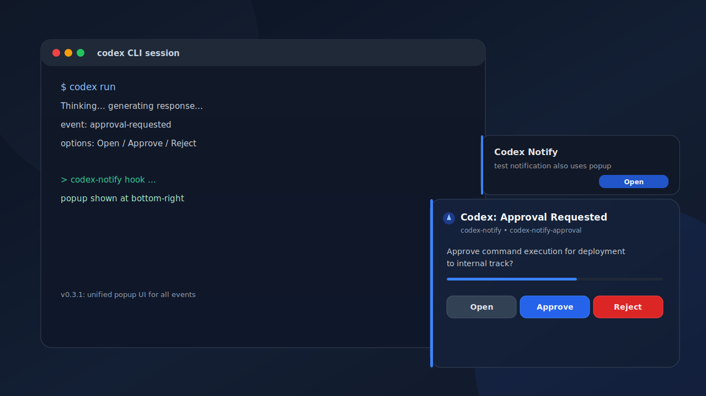

# codex-notify

`codex-notify` is a macOS-first notification bridge for Codex CLI.

- macOS only (MVP)
- Go single binary
- Safe config setup with backup
- Commercial use allowed (`Apache-2.0`)

## What It Solves

Codex already supports notifications, but behavior can depend on terminal support.
`codex-notify` gives you a direct macOS desktop notification path via Codex `notify` hook.

## Demo

Latest popup UI (v0.3.1, all events unified to bottom-right popup):



## Install (Homebrew)

```bash
brew tap MiUPa/homebrew-codex-notify
brew install codex-notify
```

The formula installs prebuilt release binaries for macOS (arm64/amd64), so local Go/CLT build steps are not required.
`brew install codex-notify` also runs `codex-notify init` via Formula `post_install` to configure the hook automatically.

`Formula/codex-notify.rb` in this repository is the source template for your tap repository (`MiUPa/homebrew-codex-notify`).

### If Homebrew install fails with CLT error

On some macOS setups, Homebrew can stop with:
- `Your Command Line Tools (CLT) does not support macOS 15`

Follow Apple's recommended recovery:

```bash
sudo rm -rf /Library/Developer/CommandLineTools
xcode-select --install
```

After installation finishes, retry:

```bash
brew install codex-notify
```

## Quick Start

1) Validate setup:

```bash
codex-notify doctor
```

2) Send a test notification:

```bash
codex-notify test "Codex通知テスト"
```

3) If doctor reports an existing non-codex `notify`, apply manually:

```bash
codex-notify init --replace
```

## Commands

```bash
codex-notify init [--replace] [--config path]
codex-notify doctor [--config path]
codex-notify test [message]
codex-notify hook [json-payload]
codex-notify action <open|approve|reject|choose|submit> [--thread-id id] [--text value]
codex-notify uninstall [--restore-config] [--config path]
```

## How `init` Works

- Detects `~/.codex/config.toml`
- Creates timestamped backup before edits
- Adds `notify = ["codex-notify", "hook"]`
- Refuses to overwrite existing `notify` unless `--replace` is specified
- Keeps repeated runs idempotent
- Homebrew install runs `init` automatically via Formula `post_install`

## Example Codex Config

```toml
notify = ["codex-notify", "hook"]
```

## Uninstall

Restore from the latest backup:

```bash
codex-notify uninstall --restore-config
```

## Event Support

- All events use popup UI by default (bottom-right corner), including `test`, `agent-turn-complete`, `approval-requested`, and unknown events.
- `approval-requested` supports selectable actions (`Open`, `Approve`, `Reject`) and dynamic payload choices.
- While the approval popup is open, incoming notifications are suppressed to avoid interruption during user action.
- Popup window size is fixed, and a `Read more` button opens the full text.
- If popup helper is unavailable, it falls back to system notification.

## Approval Actions

`approval-requested` behavior is configurable:
- `popup` (default): corner popup with visible choice buttons
  - shows all choices as buttons (for example, `yes/no` => 2 buttons)
  - reads choices from payload keys like `options` / `choices` / `approval-options`
  - if payload choices are unavailable, falls back to `Open / Approve / Reject`
  - if popup helper is unavailable, falls back to chooser dialog
- `single`: alias of `popup` (backward compatibility)
- `multi`: three popup notifications (`Open`, `Approve`, `Reject`) like previous behavior

Default behavior:
- Terminal app bundle id: `com.mitchellh.ghostty`
- Approve key sequence: `y,enter`
- Reject key sequence: `n,enter`
- Notification UI mode: `popup`
- Approval UI mode: `popup`
- Popup helper: enabled
- Popup timeout: `45` seconds

Override with environment variables:

```bash
export CODEX_NOTIFY_TERMINAL_BUNDLE_ID="com.mitchellh.ghostty"
export CODEX_NOTIFY_APPROVE_KEYS="y,enter"
export CODEX_NOTIFY_REJECT_KEYS="n,enter"
export CODEX_NOTIFY_ENABLE_APPROVAL_ACTIONS="1"
export CODEX_NOTIFY_ENABLE_POPUP_APPROVAL_ACTIONS="1"
export CODEX_NOTIFY_ENABLE_NATIVE_APPROVAL_ACTIONS="1" # legacy alias
export CODEX_NOTIFY_NOTIFICATION_UI="popup" # or "system"
export CODEX_NOTIFY_APPROVAL_UI="popup" # or "multi"
export CODEX_NOTIFY_APPROVAL_TIMEOUT_SECONDS="45"
```

Important:
- Popup UI uses a Swift helper that is compiled on first use (`swiftc` required).
- Key injection uses AppleScript (`System Events`), which may require Accessibility permission.
- Approve/Reject keys are sent to the focused terminal after it is activated.

## Development

```bash
make build
make test
```

## Release

```bash
# one-time setup:
# - add repository secret HOMEBREW_TAP_GITHUB_TOKEN
# - token scope: write access to MiUPa/homebrew-codex-notify
#
# release:
git tag vX.Y.Z
git push origin vX.Y.Z
```

The release workflow builds artifacts, publishes GitHub Release assets, and then updates
`Formula/codex-notify.rb` in `MiUPa/homebrew-codex-notify` automatically.

Manual fallback:

```bash
./scripts/gen_formula.sh vX.Y.Z
```

## Contributing

See `CONTRIBUTING.md`.

## Changelog

See `CHANGELOG.md`.

## License

Apache-2.0. See `LICENSE`.
